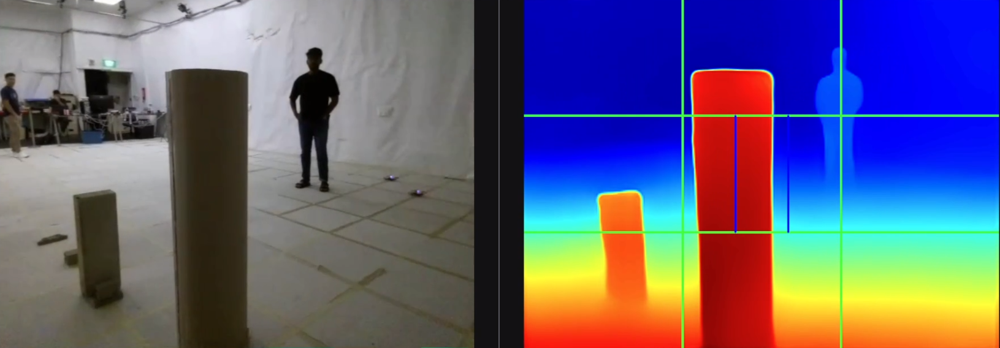

# tello_midas

ROS 2 package for monocular depth estimation using Intel ISL's [MiDaS](https://github.com/isl-org/MiDaS) model. Produces relative depth maps from Tello drone camera streams and analyzes them for obstacle avoidance via region-based color thresholding.

## Repository Structure

```
tello_midas/
├── midas_msgs/                     # Custom message definitions
│   └── msg/
│       ├── ColorCount.msg          # Red/blue/nonblue pixel counts for a region
│       └── DepthMapAnalysis.msg    # Full 6-region analysis result
└── tello_midas/                    # Python ROS 2 package
    └── tello_midas/
        ├── midas_inference.py      # Single-drone depth inference
        ├── midas_analysis.py       # Depth map region analysis
        └── multi_midas_inference.py # Multi-drone inference (shared model)
```

## Pipeline

```
                        ┌──────────────────────────┐
 /{ns}/image_raw ──────▶│  midas_inference         │──▶ /{ns}/depth/raw (32FC1)
   (sensor_msgs/Image)  │  (or multi_midas_inference)│
                        └──────────────────────────┘
                                                          │
                        ┌──────────────────────────┐      │
                        │  midas_analysis          │◀─────┘
                        │                          │
                        │  ┌───┬───┬───┐           │──▶ /{ns}/depth/colormap (BGR8)
                        │  │   │   │   │  3×3 grid │──▶ /{ns}/depth/colormap_annotated
                        │  ├───┼───┼───┤           │──▶ /{ns}/depth/analysis
                        │  │ L │ C │ R │  middle   │    (midas_msgs/DepthMapAnalysis)
                        │  ├───┼───┼───┤  row      │
                        │  │   │   │   │           │
                        │  └───┴───┴───┘           │
                        └──────────────────────────┘
```

In a multi-drone deployment, `multi_midas_inference` replaces per-drone `midas_inference` nodes — it loads the PyTorch model **once** and multiplexes all drone image streams through it. A separate `midas_analysis` node still runs inside each drone namespace.

## Nodes

### midas_inference

Runs MiDaS depth estimation on a single camera stream. Loaded via `torch.hub` from Intel ISL.

**Source:** [midas_inference.py](tello_midas/tello_midas/midas_inference.py)

#### Parameters

| Parameter | Type | Default | Description |
|:--|:--|:--|:--|
| `model_type` | `string` | `MiDaS_small` | Model variant: `MiDaS_small`, `DPT_Hybrid`, `DPT_Large`. Small is recommended for CPU. |
| `input_topic` | `string` | `image_raw` | Input RGB image topic (relative to node namespace). |
| `output_raw_topic` | `string` | `depth/raw` | Output depth map topic. |

#### Subscribed Topics

| Topic | Type | Description |
|:--|:--|:--|
| `image_raw` | `sensor_msgs/Image` | Input camera stream (BGR8). |

#### Published Topics

| Topic | Type | Description |
|:--|:--|:--|
| `depth/raw` | `sensor_msgs/Image` | Raw relative depth map, encoding `32FC1`. |

> **Optimization:** Inference is skipped when `depth/raw` has zero subscribers, saving GPU/CPU cycles.

---

### midas_analysis

Converts raw depth maps to JET colormaps and analyzes obstacle proximity using color thresholding. The image is divided into a 3×3 grid; the **middle row** (left, center, right) is analyzed for red (close) vs blue (far) pixel counts. The middle-center cell is further subdivided into three columns for finer forward-obstacle detection.

**Source:** [midas_analysis.py](tello_midas/tello_midas/midas_analysis.py)

#### Region Layout

```
┌───────────┬───────────┬───────────┐
│  (unused) │  (unused) │  (unused) │   top row
├───────────┼───────────┼───────────┤
│  middle   │  middle   │  middle   │   ← analyzed
│  _left    │  _center  │  _right   │
├───────────┼───┬───┬───┼───────────┤
│           │ L │ C │ R │           │   ← mc_left / mc_center / mc_right
├───────────┼───────────┼───────────┤     (sub-regions of middle_center)
│  (unused) │  (unused) │  (unused) │   bottom row
└───────────┴───────────┴───────────┘
```



**Obstacle detection logic** (used by `mission_control`):

```python
if depth.middle_center.red > depth.middle_center.blue:
    # Obstacle detected ahead — rotate or evade
```

#### Parameters

| Parameter | Type | Default | Description |
|:--|:--|:--|:--|
| `input_depth_topic` | `string` | `depth/raw` | Input raw depth map (32FC1). |
| `output_colormap_topic` | `string` | `depth/colormap` | Clean JET colormap output. |
| `output_annotated_colormap_topic` | `string` | `depth/colormap_annotated` | JET colormap with grid overlay. |
| `output_colormap_analysis_topic` | `string` | `depth/analysis` | Region analysis data. |

#### Subscribed Topics

| Topic | Type | Description |
|:--|:--|:--|
| `depth/raw` | `sensor_msgs/Image` | Raw depth map (32FC1) from inference node. |

#### Published Topics

| Topic | Type | Description |
|:--|:--|:--|
| `depth/colormap` | `sensor_msgs/Image` | BGR8 JET colormap visualization. |
| `depth/colormap_annotated` | `sensor_msgs/Image` | BGR8 JET colormap with green 3×3 grid and blue sub-grid lines. |
| `depth/analysis` | `midas_msgs/DepthMapAnalysis` | Per-region red/blue/nonblue pixel counts. |

> **Optimization:** Each publisher only processes if it has active subscribers.

---

### multi_midas_inference

Resource-efficient inference node for multi-drone swarms. Loads the MiDaS model into memory **once** and creates per-drone subscriber/publisher pairs. Images are processed sequentially as callbacks arrive.

**Source:** [multi_midas_inference.py](tello_midas/tello_midas/multi_midas_inference.py)

#### Parameters

| Parameter | Type | Default | Description |
|:--|:--|:--|:--|
| `model_type` | `string` | `MiDaS_small` | Model variant. |
| `drone_ids` | `string[]` | `["tello1", "tello2"]` | Drone namespace IDs. |

#### Per-Drone Topics

For each `id` in `drone_ids`:

| Direction | Topic | Type |
|:--|:--|:--|
| Subscribe | `/{id}/image_raw` | `sensor_msgs/Image` |
| Publish | `/{id}/depth/raw` | `sensor_msgs/Image` (32FC1) |

## Custom Messages (midas_msgs)

### ColorCount.msg

```
int32 red       # Pixels with high red, low blue (close obstacles)
int32 blue      # Pixels with high blue, low red (far/clear)
int32 nonblue   # Total pixels minus blue count (used for sub-regions)
```

### DepthMapAnalysis.msg

```
std_msgs/Header header

# Middle row — 3 regions (left third, center third, right third)
ColorCount middle_left
ColorCount middle_center
ColorCount middle_right

# Middle-center sub-regions — center third split into 3 columns
ColorCount mc_left
ColorCount mc_center
ColorCount mc_right
```

## QoS Profile

All image topics use the same profile to minimize latency over potentially lossy wireless connections:

| Setting | Value |
|:--|:--|
| Reliability | `BEST_EFFORT` |
| Durability | `VOLATILE` |
| History | `KEEP_LAST` |
| Depth | `1` |

## Usage

### Multi-Drone (production)

All nodes are launched automatically by the multi-drone bringup launch file:

```bash
ros2 launch tello_bringup multi_drone_launch.py
```

This starts:
- **One** `multi_midas_inference` node (global, shared model for all drones)
- **One** `midas_analysis` node per drone (inside each drone namespace)

Drone IDs are read from `tello_bringup/config/drone_params.yaml`.

### Single-Drone (development / testing)

```bash
# Inference node
ros2 run tello_midas midas_inference --ros-args \
  -p model_type:=MiDaS_small \
  -r image_raw:=/tello1/image_raw \
  -r depth/raw:=/tello1/depth/raw

# Analysis node
ros2 run tello_midas midas_analysis --ros-args \
  -r depth/raw:=/tello1/depth/raw

# Multi-drone inference (standalone)
ros2 run tello_midas multi_midas_inference --ros-args \
  -p drone_ids:="[tello1,tello2,tello3]"
```

### Debugging

```bash
# View JET colormap
ros2 run rqt_image_view rqt_image_view /tello1/depth/colormap

# View annotated colormap with grid
ros2 run rqt_image_view rqt_image_view /tello1/depth/colormap_annotated

# Monitor analysis data
ros2 topic echo /tello1/depth/analysis

# Check inference throughput
ros2 topic hz /tello1/depth/raw
```

## Model Variants

| Model | Speed | Accuracy | Recommended For |
|:--|:--|:--|:--|
| `MiDaS_small` | Fast | Good | CPU inference, real-time on Tello |
| `DPT_Hybrid` | Medium | Better | GPU with moderate resources |
| `DPT_Large` | Slow | Best | Offline analysis, powerful GPU |

Models are downloaded automatically on first launch via `torch.hub`.

## Dependencies

| Dependency | Type | Purpose |
|:--|:--|:--|
| `rclpy` | ROS 2 | Python client library |
| `sensor_msgs` | ROS 2 | `Image` message type |
| `cv_bridge` | ROS 2 | ROS Image ↔ OpenCV conversion |
| `std_msgs` | ROS 2 | `Header` for timestamping |
| `midas_msgs` | Local | `DepthMapAnalysis`, `ColorCount` messages |
| `torch`, `torchvision` | Python (pip) | PyTorch for MiDaS inference |
| `timm` | Python (pip) | PyTorch Image Models, required by MiDaS |
| `opencv-python` | Python | Image processing, colormap, integral images |
| `numpy` | Python | Array operations |

### Python Dependencies Installation

```bash
# PyTorch with CUDA 12.6 support
pip3 install torch torchvision --index-url https://download.pytorch.org/whl/cu126 --break-system-packages

# timm (required by MiDaS model loader)
pip3 install timm --break-system-packages
```

> For CPU-only systems or other CUDA versions, see the [PyTorch install guide](https://pytorch.org/get-started/locally/) to get the correct `--index-url`.

## Building

```bash
cd ~/tello_ros_ws
source /opt/ros/jazzy/setup.bash
colcon build --symlink-install --packages-select midas_msgs tello_midas
source install/setup.bash
```

> **Note:** `midas_msgs` must be built before `tello_midas`. colcon resolves this automatically via declared dependencies.